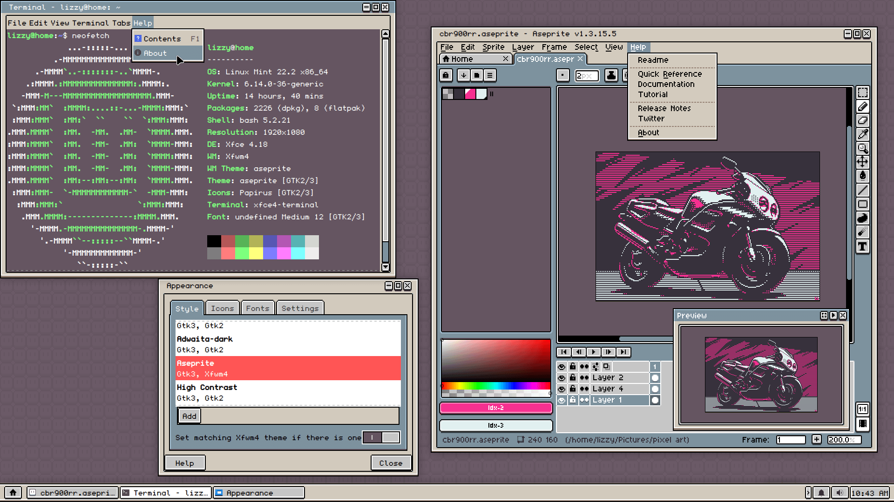

<div align="center">

# Aseprite-GTK-theme

### A Linux GTK theme inspired by Aseprite's pixel-perfect aesthetic



</div>

---

## 📋 Overview

A clean, pixel-art inspired GTK theme that brings Aseprite's distinctive look to your entire Linux desktop. Perfect for artists, developers, and anyone who appreciates a retro aesthetic.

## 🖼️ Setup Details

- **Desktop Environment:** XFCE
- **Font:** Undefined Medium
- **Wallpaper:** [Download here](https://imgur.com/a/mN1T0em)

## 📦 Installation

### Method 1: User Installation (Recommended)

Install the theme for your user account only:

```bash
# Clone the repository into your themes directory
git clone https://github.com/lizbeanz/Aseprite-GTK-theme.git ~/.themes/Aseprite-GTK-theme
```

### Method 2: System-wide Installation

Install the theme for all users (requires sudo):

```bash
# Clone to system themes directory
sudo git clone https://github.com/lizbeanz/Aseprite-GTK-theme.git /usr/share/themes/Aseprite-GTK-theme
```

## 🎨 Applying the Theme

### XFCE

1. Open **Settings Manager**
2. Navigate to **Appearance**
3. Select **Aseprite-GTK-theme** from the list
4. (Optional) Go to **Window Manager** settings to apply matching window decorations


### Other Desktop Environments

Use your DE's appearance/theme settings or a tool like `lxappearance`:

```bash
lxappearance
```

## 🔄 Updating

To update the theme to the latest version:

```bash
cd ~/.themes/Aseprite-GTK-theme
git pull origin main
```

## 🗑️ Uninstallation

```bash
# For user installation
rm -rf ~/.themes/Aseprite-GTK-theme

# For system-wide installation
sudo rm -rf /usr/share/themes/Aseprite-GTK-theme
```

## 🙏 Credits

- **Original Theme:** [lizbeanz](https://github.com/lizbeanz/Aseprite-GTK-theme)
- **Inspiration:** [Aseprite](https://www.aseprite.org/) - Animated sprite editor & pixel art tool

## 📝 License

Please refer to the [original repository](https://github.com/lizbeanz/Aseprite-GTK-theme) for licensing information.

## 🐛 Issues & Contributions

Found a bug or want to contribute? Visit the [original repository](https://github.com/lizbeanz/Aseprite-GTK-theme/issues) to report issues or submit pull requests.

---

<div align="center">

**Enjoy your pixel-perfect desktop! 🎨**

</div>
